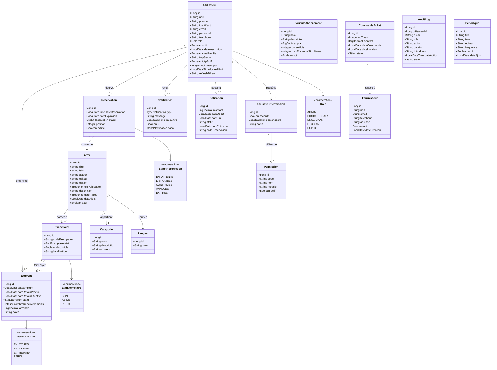
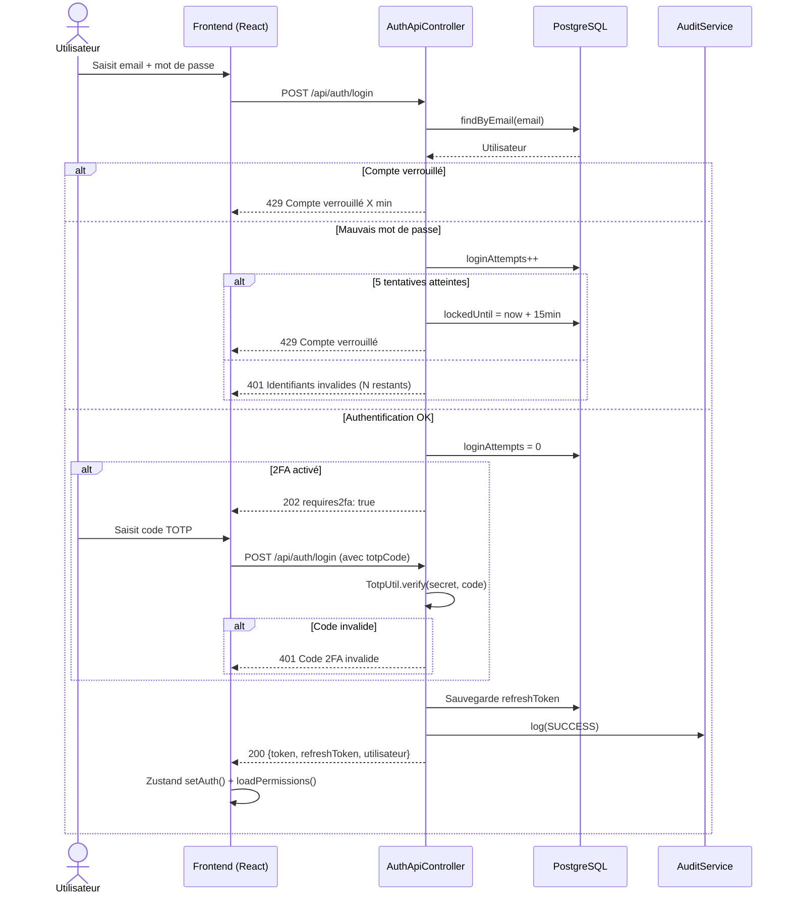
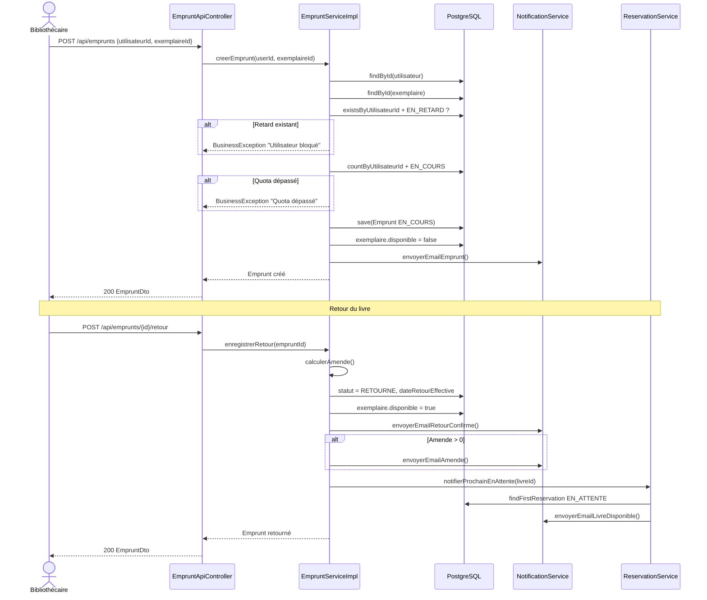
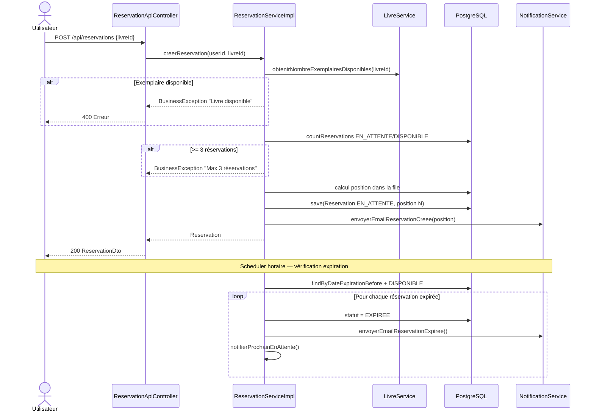
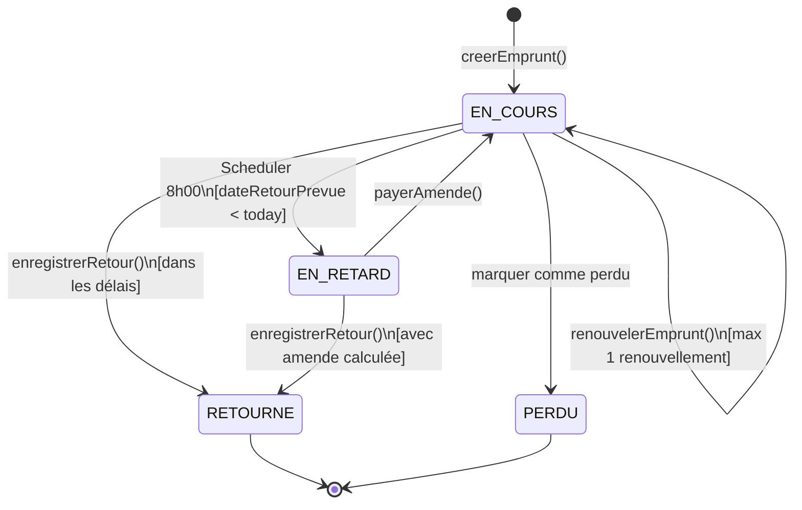
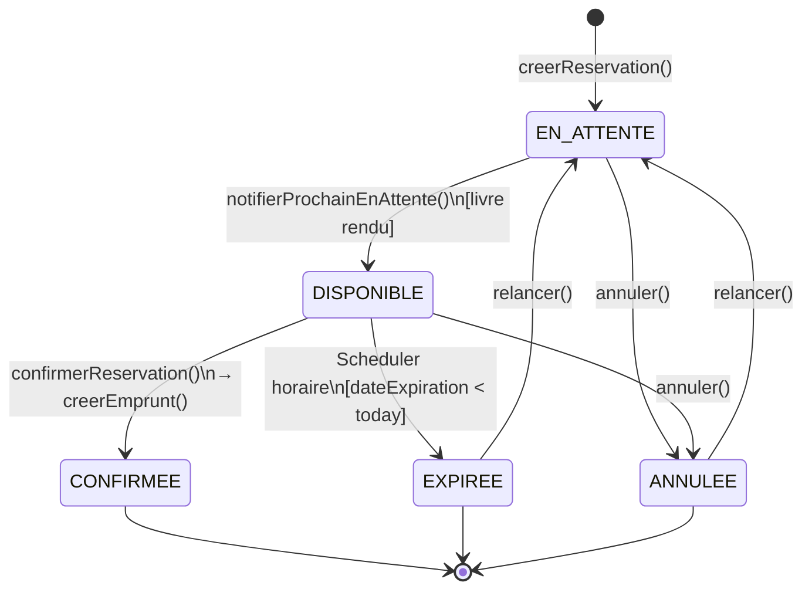
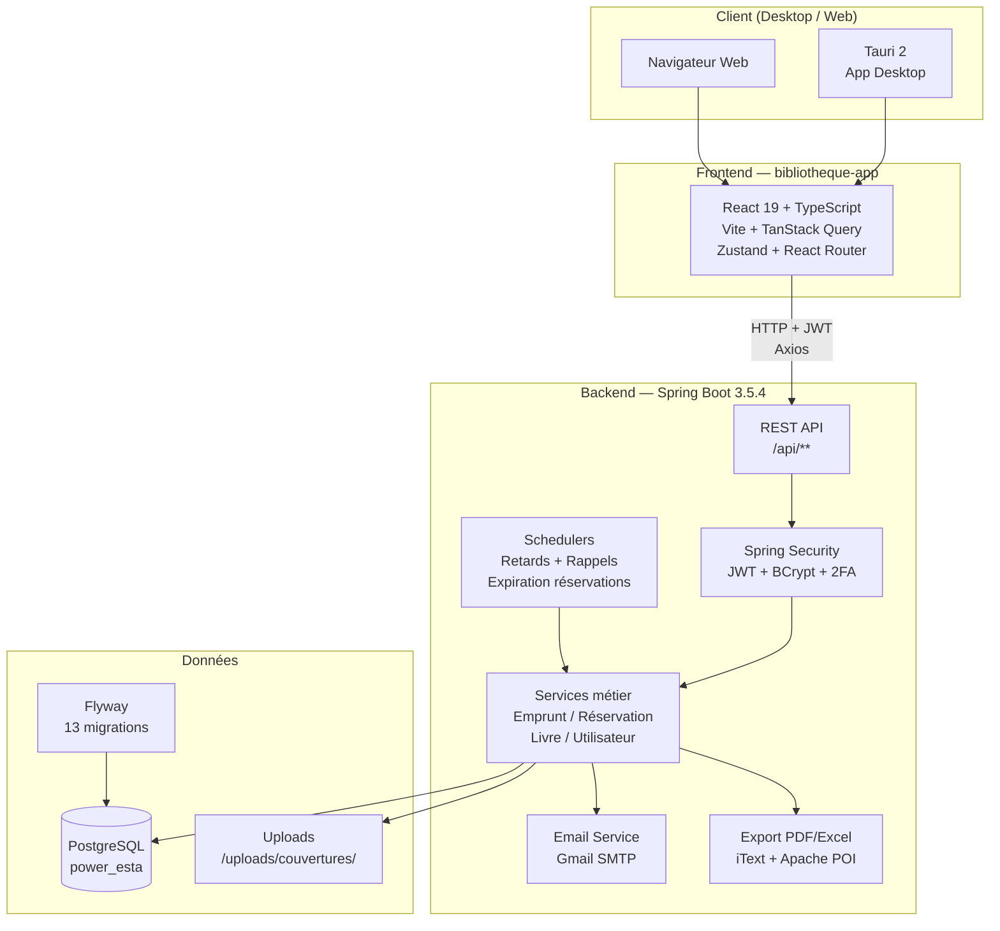
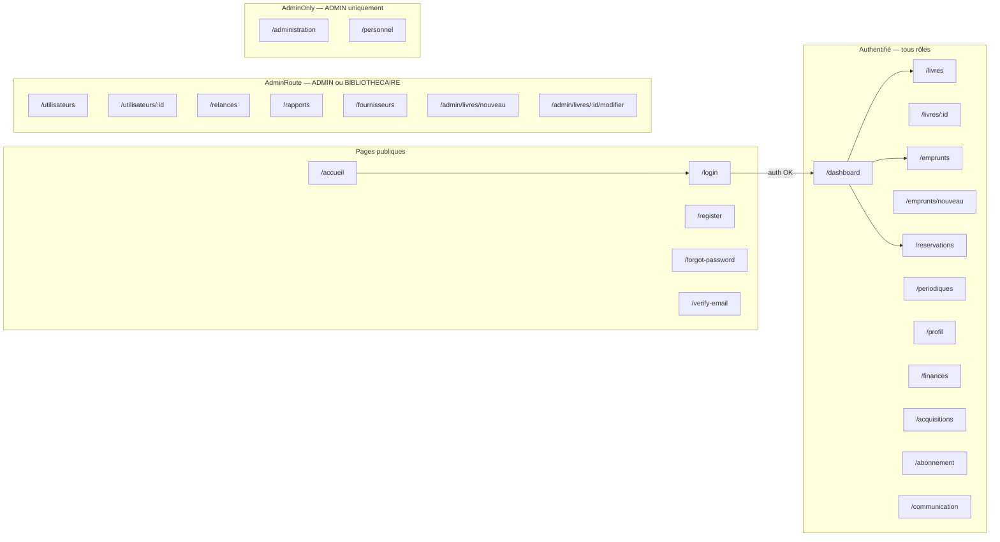

# Diagrammes — Bibliothèque ESTA
> Coller chaque bloc dans https://mermaid.live

---

## 1. Diagramme de classes — Entités JPA

---

## 2. Diagramme de séquence — Connexion (Login + 2FA)

---

## 3. Diagramme de séquence — Cycle de vie d'un emprunt

---

## 4. Diagramme de séquence — Réservation

---

## 5. Diagramme d'états — Emprunt

---

## 6. Diagramme d'états — Réservation

---

## 7. Architecture applicative (C4 — Conteneurs)

---

## 8. Diagramme de navigation Frontend (Routes)

