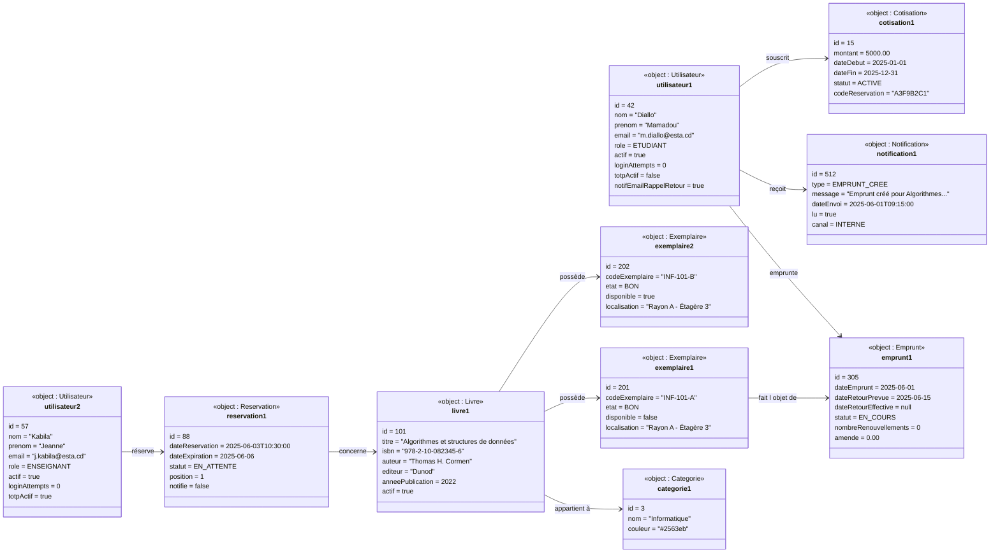
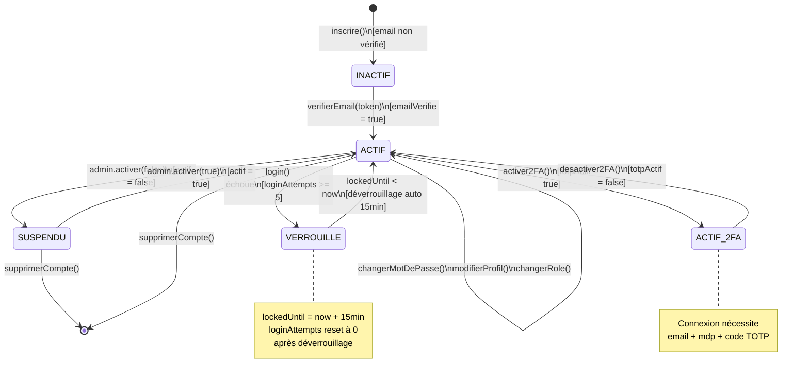
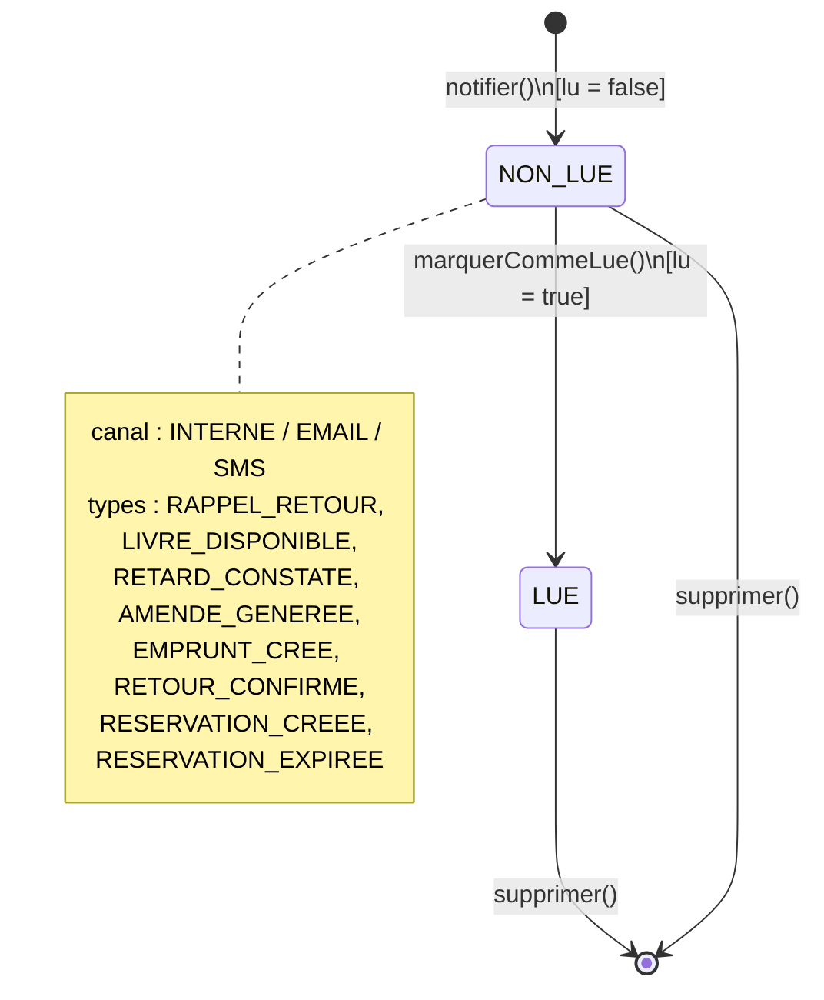
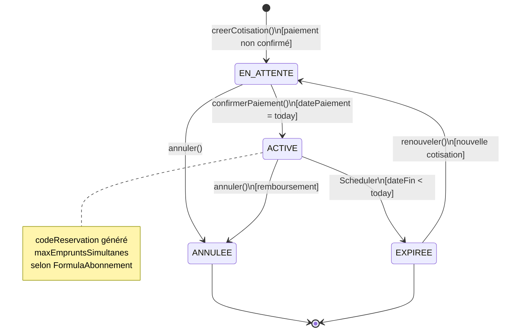
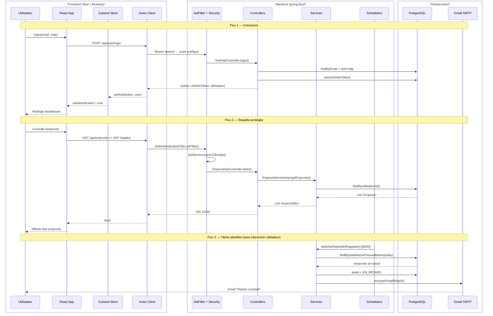
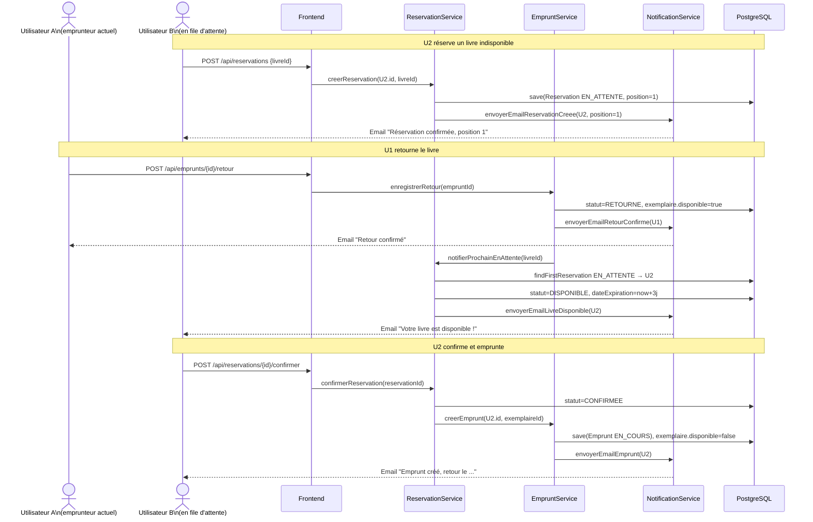

# Diagrammes UML — Bibliothèque ESTA (suite)
> Coller chaque bloc dans https://mermaid.live

---

## 17. Diagramme de cas d'utilisation

```mermaid
graph TB
    %% Acteurs
    ETUDIANT(["👤 Étudiant / Enseignant\n/ Public"])
    BIBLIO(["👤 Bibliothécaire"])
    ADMIN(["👤 Administrateur"])
    SCHED(["⚙️ Scheduler\n(système)"])

    %% Cas d'utilisation — Authentification
    subgraph UC_AUTH["Authentification"]
        UC1["S'inscrire"]
        UC2["Se connecter"]
        UC3["Activer 2FA"]
        UC4["Réinitialiser mot de passe"]
        UC5["Vérifier email"]
    end

    %% Cas d'utilisation — Catalogue
    subgraph UC_CAT["Catalogue"]
        UC6["Consulter le catalogue"]
        UC7["Rechercher un livre"]
        UC8["Voir détail d'un livre"]
    end

    %% Cas d'utilisation — Emprunts
    subgraph UC_EMP["Emprunts"]
        UC9["Emprunter un livre"]
        UC10["Retourner un livre"]
        UC11["Renouveler un emprunt"]
        UC12["Consulter ses emprunts"]
        UC13["Payer une amende"]
    end

    %% Cas d'utilisation — Réservations
    subgraph UC_RES["Réservations"]
        UC14["Réserver un livre"]
        UC15["Annuler une réservation"]
        UC16["Confirmer une réservation"]
        UC17["Consulter ses réservations"]
    end

    %% Cas d'utilisation — Profil
    subgraph UC_PROFIL["Profil"]
        UC18["Modifier son profil"]
        UC19["Changer mot de passe"]
        UC20["Gérer notifications email"]
    end

    %% Cas d'utilisation — Admin/Biblio
    subgraph UC_ADMIN["Gestion (Admin / Bibliothécaire)"]
        UC21["Gérer les livres\n(CRUD + exemplaires)"]
        UC22["Gérer les utilisateurs"]
        UC23["Gérer les fournisseurs"]
        UC24["Gérer les acquisitions"]
        UC25["Gérer les périodiques"]
        UC26["Consulter les rapports"]
        UC27["Envoyer des relances"]
        UC28["Gérer les cotisations"]
    end

    %% Cas d'utilisation — Admin uniquement
    subgraph UC_ADMIN_ONLY["Administration (Admin uniquement)"]
        UC29["Gérer le personnel"]
        UC30["Gérer les permissions"]
        UC31["Consulter les logs d'audit"]
        UC32["Gérer les formules d'abonnement"]
    end

    %% Cas d'utilisation — Scheduler
    subgraph UC_SCHED["Tâches automatiques"]
        UC33["Détecter les retards\n(cron 8h00)"]
        UC34["Envoyer rappels J-3"]
        UC35["Expirer les réservations\n(cron /h)"]
    end

    %% Relations Étudiant/Enseignant/Public
    ETUDIANT --> UC1
    ETUDIANT --> UC2
    ETUDIANT --> UC3
    ETUDIANT --> UC4
    ETUDIANT --> UC5
    ETUDIANT --> UC6
    ETUDIANT --> UC7
    ETUDIANT --> UC8
    ETUDIANT --> UC12
    ETUDIANT --> UC14
    ETUDIANT --> UC15
    ETUDIANT --> UC17
    ETUDIANT --> UC18
    ETUDIANT --> UC19
    ETUDIANT --> UC20
    ETUDIANT --> UC11
    ETUDIANT --> UC13

    %% Relations Bibliothécaire (hérite des droits utilisateur + gestion)
    BIBLIO --> UC9
    BIBLIO --> UC10
    BIBLIO --> UC16
    BIBLIO --> UC21
    BIBLIO --> UC22
    BIBLIO --> UC23
    BIBLIO --> UC24
    BIBLIO --> UC25
    BIBLIO --> UC26
    BIBLIO --> UC27
    BIBLIO --> UC28

    %% Relations Admin (hérite de tout)
    ADMIN --> UC29
    ADMIN --> UC30
    ADMIN --> UC31
    ADMIN --> UC32

    %% Scheduler
    SCHED --> UC33
    SCHED --> UC34
    SCHED --> UC35
```

---

## 18. Diagramme d'objets — Scénario : emprunt en cours avec réservation en attente

---

## 19. Diagramme d'états-transitions — Compte Utilisateur

---

## 20. Diagramme d'états-transitions — Notification

---

## 21. Diagramme d'états-transitions — Cotisation (Abonnement)

---

## 22. Diagramme d'interaction — Vue d'ensemble du système (Communication)

---

## 23. Diagramme d'interaction — Cycle complet Réservation → Emprunt

